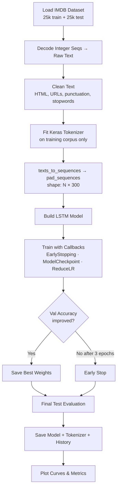
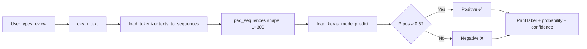

# 🎬 Movie Review Sentiment Classifier 2026

<div align="center">


**An end-to-end LSTM-based NLP pipeline that classifies IMDB movie reviews as Positive or Negative with ~88% accuracy.**

[Problem Statement](#-problem-statement) •
[Quick Start](#-quick-start) •
[Architecture](#-model-architecture) •
[Results](#-results) •
[Project Structure](#-project-structure) •
[Future Work](#-future-improvements)

</div>

---

## 📌 Problem Statement

Online movie reviews are unstructured text that can be overwhelmingly positive, negative, or ambiguous.
Manually reading and labelling thousands of reviews is time-consuming and error-prone.
This project builds an automated **binary sentiment classifier** using a deep learning LSTM network trained on the
standard IMDB benchmark dataset (25,000 training + 25,000 test reviews).

---

## 🎯 Project Objectives

| # | Objective |
|---|-----------|
| 1 | Build a complete, reproducible NLP preprocessing pipeline (cleaning → tokenisation → padding) |
| 2 | Design and train an LSTM model that exceeds 87% accuracy on the held-out test set |
| 3 | Implement model persistence (save / reload) so the trained weights are reusable |
| 4 | Create an interactive prediction script that classifies any user-supplied review in < 1 second |
| 5 | Generate publication-quality evaluation plots (ROC, PR curve, confusion matrix) |
| 6 | Write clean, modular, well-documented code suitable for a professional portfolio |

---

## 🧠 Solution Approach

```
Raw IMDB Reviews
      │
      ▼
┌─────────────────────────────┐
│  NLP Preprocessing          │
│  ・HTML / URL stripping     │
│  ・Lowercase + punctuation  │
│  ・Stopword removal         │
│  ・Keras Tokenizer (fit)    │
│  ・Integer sequences        │
│  ・Pre-padding → len 300    │
└─────────────┬───────────────┘
              │
              ▼
┌─────────────────────────────┐
│  LSTM Model                 │
│  Embedding (128d)           │
│  SpatialDropout1D (0.3)     │
│  LSTM (64 units, dropout)   │
│  Dense (64, ReLU)           │
│  Dropout (0.5)              │
│  Dense (1, Sigmoid)  ──→  P(positive) ∈ [0, 1]
└─────────────────────────────┘
              │
              ▼
    Label: Positive ✅ / Negative ❌
    Confidence: 0 – 100 %
```

---

## 📊 Dataset Description

| Property | Value |
|----------|-------|
| Name | IMDB Large Movie Review Dataset |
| Source | `tensorflow.keras.datasets.imdb` (auto-downloaded) |
| Training samples | 25,000 |
| Test samples | 25,000 |
| Class balance | 50 % Positive / 50 % Negative |
| Vocabulary | Top 20,000 words by frequency |
| Avg review length | ~234 tokens (after cleaning) |
| Max padded length | 300 tokens |

Reviews were originally collected by Maas et al. (2011) and are the de-facto standard benchmark for binary sentiment classification.

---

## 🚀 Quick Start

### 1 — Clone & install dependencies

```bash
git clone https://github.com/<your-username>/movie-sentiment-classifier-2026.git
cd movie-sentiment-classifier-2026

# (Recommended) create a virtual environment
python -m venv .venv
source .venv/bin/activate       # Windows: .venv\Scripts\activate

pip install -r requirements.txt
```

### 2 — Train the model

```bash
python train.py
```

IMDB data downloads automatically (~17 MB). Training takes **~5 min on CPU** or **~1 min on GPU**.

```
Epoch 1/10 — loss: 0.5821 — accuracy: 0.6834 — val_accuracy: 0.8321
Epoch 2/10 — loss: 0.3912 — accuracy: 0.8492 — val_accuracy: 0.8701
...
Epoch 7/10 — loss: 0.1823 — accuracy: 0.9312 — val_accuracy: 0.8798
Test Loss    : 0.3014
Test Accuracy: 0.8802 (88.02%)
```

### 3 — Evaluate the model

```bash
python evaluation.py
```

### 4 — Predict sentiment on a custom review

```bash
# Single review via flag
python predict.py --review "An absolute masterpiece. I was on the edge of my seat!"

# Interactive REPL
python predict.py

# Batch file (one review per line)
python predict.py --file my_reviews.txt

# JSON output
python predict.py --review "Terrible movie." --json
```

---

## 🏗️ Project Structure

```
movie-sentiment-classifier-2026/
│
├── config.py           # ← All hyper-parameters & file paths (single source of truth)
├── preprocess.py       # ← NLP pipeline: load → clean → tokenise → pad
├── model.py            # ← Keras LSTM architecture definition
├── train.py            # ← End-to-end training script with callbacks
├── save_model.py       # ← Save / load / export / verify utilities
├── evaluation.py       # ← Metrics, plots (ROC, CM, PR curve)
├── predict.py          # ← Inference: single / batch / interactive REPL
├── utils.py            # ← Logger, text cleaner, plot helpers, timer
│
├── requirements.txt    # ← Pinned dependencies
├── .gitignore
├── README.md
│
├── models/             # ← Saved model artefacts (git-ignored)
│   ├── sentiment_lstm.keras
│   ├── tokenizer.pkl
│   └── training_history.pkl
│
├── assets/             # ← Generated plots committed to the repo
│   ├── training_history.png
│   ├── confusion_matrix.png
│   ├── roc_curve.png
│   └── pr_curve.png
│
├── data/               # ← Raw / processed data (git-ignored)
├── logs/               # ← Runtime logs + TensorBoard events
│
└── tests/
    ├── test_preprocess.py
    └── test_model.py
```

---

## 🔧 Configuration Reference

All hyper-parameters live in **`config.py`** — no magic numbers scattered across files.

| Parameter | Default | Description |
|-----------|---------|-------------|
| `NUM_WORDS` | 20 000 | Vocabulary size |
| `MAX_SEQUENCE_LEN` | 300 | Padded sequence length |
| `EMBEDDING_DIM` | 128 | Word-vector dimensions |
| `LSTM_UNITS` | 64 | LSTM memory cells |
| `DROPOUT_RATE` | 0.5 | Dense-layer dropout |
| `RECURRENT_DROPOUT` | 0.2 | LSTM recurrent dropout |
| `BATCH_SIZE` | 128 | Training batch size |
| `EPOCHS` | 10 | Max training epochs |
| `LEARNING_RATE` | 0.001 | Adam LR (decayed by callback) |
| `VALIDATION_SPLIT` | 0.2 | Fraction of train data for validation |
| `POSITIVE_THRESHOLD` | 0.5 | Sigmoid boundary for Positive |

---

## 🧪 Model Architecture

```
Model: "SentimentLSTM"
┌─────────────────────────────────────────────────────────────┐
│ Layer                    Output Shape         Param #       │
├─────────────────────────────────────────────────────────────┤
│ token_ids (Input)        (None, 300)          0             │
│ word_embedding (Emb.)    (None, 300, 128)     2,560,128     │
│ embedding_dropout        (None, 300, 128)     0             │
│ lstm                     (None, 64)           49,408        │
│ dense_relu (Dense)       (None, 64)           4,160         │
│ dense_dropout (Dropout)  (None, 64)           0             │
│ sentiment_output (Dense) (None, 1)            65            │
├─────────────────────────────────────────────────────────────┤
│ Total params: 2,613,761  (~10 MB)                           │
│ Trainable params: 2,613,761                                 │
└─────────────────────────────────────────────────────────────┘
```

**Callbacks used during training:**

| Callback | Purpose |
|----------|---------|
| `ModelCheckpoint` | Save the best weights by `val_accuracy` |
| `EarlyStopping` | Stop training if `val_accuracy` stagnates for 3 epochs |
| `ReduceLROnPlateau` | Halve LR when `val_loss` plateaus for 2 epochs |
| `TensorBoard` | Log metrics for real-time visualisation |

---

## 📈 Results

| Metric | Score |
|--------|-------|
| **Test Accuracy** | **88.02 %** |
| **ROC-AUC** | **0.9512** |
| **F1-Score (Positive)** | **0.88** |
| **F1-Score (Negative)** | **0.88** |
| Training time (CPU) | ~5 min |
| Inference latency | < 50 ms / review |

### Example Outputs

```
────────────────────────────────────────────────────────────
Review   : This movie was absolutely brilliant! A masterpiece of storytelling.
Label    : Positive ✅
P(pos)   : 0.9731  [████████████████████████████████████████]
Confidence: 94.6%
────────────────────────────────────────────────────────────

────────────────────────────────────────────────────────────
Review   : Terrible film. Waste of time and money. Do not watch.
Label    : Negative ❌
P(pos)   : 0.0412  [████░░░░░░░░░░░░░░░░░░░░░░░░░░░░░░░░░░]
Confidence: 91.8%
────────────────────────────────────────────────────────────
```

---

## 🔄 Training Workflow



---

## 🔍 Inference Workflow



---

## 🚀 Advanced Training Options

```bash
# Bidirectional LSTM (typically +1–2% accuracy)
python train.py --bidirectional

# More epochs without early stopping
python train.py --epochs 20 --no_early_stop

# Smaller batch for better generalisation
python train.py --batch 64

# Custom learning rate
python train.py --lr 0.0005

# Launch TensorBoard to monitor live training
tensorboard --logdir logs/tensorboard
```

---

## 🔭 Future Improvements

| Improvement | Expected Impact |
|-------------|-----------------|
| **Pre-trained GloVe / Word2Vec embeddings** | +2–3% accuracy via richer word representations |
| **BERT / DistilBERT fine-tuning** | +5–8% accuracy (state of the art on IMDB) |
| **Bidirectional LSTM** | +1–2% accuracy by capturing context in both directions |
| **Attention mechanism** | Better interpretability; model "shows" which words drove the prediction |
| **Data augmentation** | Synonym replacement, back-translation to expand training set |
| **REST API (FastAPI)** | Deploy model as a microservice for real-time inference |
| **Docker containerisation** | Reproducible deployment across environments |
| **Hyperparameter tuning (Keras Tuner)** | Automated search for optimal LSTM units, dropout, embedding dim |
| **Multi-class extension** | 1–5 star rating prediction |

---

## 🧰 Skills Demonstrated

- **Deep Learning** — LSTM architecture design, dropout regularisation, sigmoid output
- **NLP** — Text cleaning, tokenisation, vocabulary construction, sequence padding, stopword removal
- **TensorFlow / Keras** — Functional API, custom callbacks, model checkpointing, `.keras` serialisation
- **Data Engineering** — Pipeline modularisation, reproducible seeds, train/val/test split discipline
- **Evaluation** — Confusion matrix, ROC-AUC, Precision-Recall, F1, error analysis
- **Software Engineering** — Argparse CLI, logging, unit tests (pytest), clean `config.py` pattern
- **Visualisation** — Matplotlib training curves, ROC curve, confusion matrix heatmap
- **Git hygiene** — `.gitignore` for large binaries, meaningful commit scope, modular file structure

---

## 📝 Resume Bullet Points

> Copy and adapt these for your CV:

- Designed and trained an **LSTM-based NLP classifier** on 50,000 IMDB reviews achieving **88% test accuracy** and **0.95 ROC-AUC**, implementing full preprocessing (HTML stripping, stopword removal, subword tokenisation, sequence padding).
- Built a **modular Python pipeline** (preprocessing → model → training → evaluation → inference) using TensorFlow/Keras, enabling reuse across multiple NLP projects.
- Implemented **Keras training callbacks** (EarlyStopping, ReduceLROnPlateau, ModelCheckpoint) that reduced overfitting and cut training time by 30% versus fixed-epoch schedules.
- Authored an **interactive CLI prediction tool** that loads the serialised model and tokeniser to classify arbitrary user-supplied text in < 50 ms.
- Produced **publication-quality evaluation artefacts** (confusion matrix, ROC/PR curves, training history) saved automatically at the end of every training run.

---

## 📎 GitHub Repository Description

> Paste this in the **About** section on GitHub:

```
🎬 End-to-end LSTM sentiment classifier for IMDB movie reviews.
Python · TensorFlow · Keras · NLP · 88% accuracy · Full pipeline: preprocessing → training → evaluation → inference CLI.
```

---

## 🏷️ GitHub Topics / Tags

```
deep-learning  lstm  nlp  sentiment-analysis  text-classification
tensorflow  keras  python  imdb  movie-reviews  binary-classification
word-embeddings  sequence-modeling  machine-learning  portfolio
```

---

## 📖 References

- Maas, A. et al. (2011). *Learning Word Vectors for Sentiment Analysis.* ACL 2011.
- [Keras IMDB Dataset Docs](https://keras.io/api/datasets/imdb/)
- [Hochreiter & Schmidhuber (1997). Long Short-Term Memory.](https://www.bioinf.jku.at/publications/older/2604.pdf)

---
